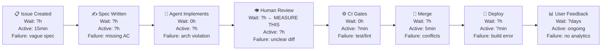

# Value Stream Map — [PROJECT NAME]

> DORA 2025 (VSM-01): “VSM acts as an AI force multiplier. By visualising your flow
> from idea to customer, you can identify where work waits and where friction exists.
> Without it, AI creates local optimisations that pile up work downstream.”
>
> Complete before Phase 2 work begins. Review monthly.
> Instructions: For each step, record average wait time, active time, and primary failure reason
> from your last 10 PRs.

-----

## Current Flow Map

-----

## Step-by-Step Data

|Step            |Avg Wait Time     |Avg Active Time  |Primary Failure Reason     |AI Insertion Point          |
|----------------|------------------|-----------------|---------------------------|----------------------------|
|Issue Created   |—                 |15 min           |Vague spec                 |PM uses Copilot to draft AC |
|Spec Written    |[PLACEHOLDER]     |[PLACEHOLDER]    |Missing acceptance criteria|—                           |
|Agent Implements|0 (async)         |[PLACEHOLDER]    |Architecture violation     |Copilot implements from spec|
|Human Review    |**[MEASURE THIS]**|[PLACEHOLDER]    |Unclear diff               |@review-agent pre-screens   |
|CI Gates        |0                 |[target: < 4 min]|Test failure               |Automated                   |
|Merge           |[PLACEHOLDER]     |5 min            |Merge conflict             |—                           |
|Deploy          |[PLACEHOLDER]     |[PLACEHOLDER]    |Build error                |Automated                   |
|User Feedback   |[PLACEHOLDER]     |ongoing          |No analytics               |—                           |

-----

## Bottleneck Identification

**Current bottleneck:** [PLACEHOLDER — the step with highest wait-to-active ratio]

**Evidence:** [PLACEHOLDER — data from last 10 PRs]

**Root cause:** [PLACEHOLDER]

**Follow-up issue filed:** #[PLACEHOLDER]

-----

## AI Insertion Points

Where Copilot currently adds value:

- [PLACEHOLDER]

Where Copilot currently creates friction:

- [PLACEHOLDER]

-----

## Revision History

|Date         |Who |What Changed       |
|-------------|----|-------------------|
|[PLACEHOLDER]|[PM]|Initial map created|
